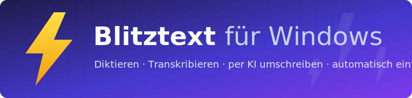
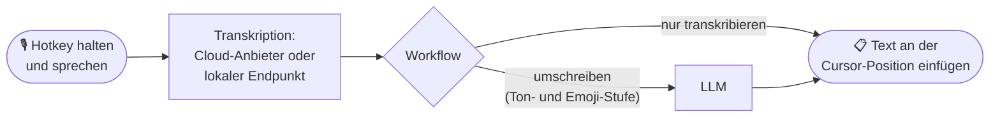
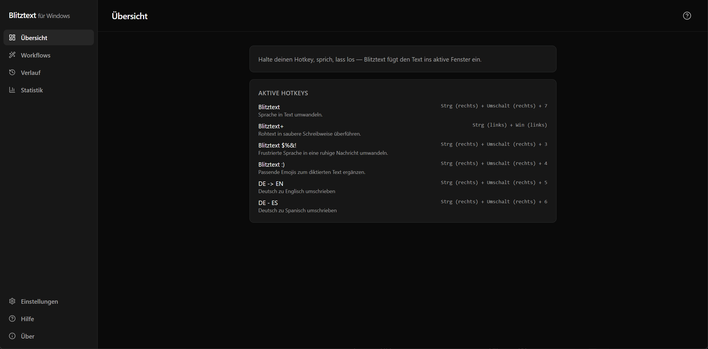
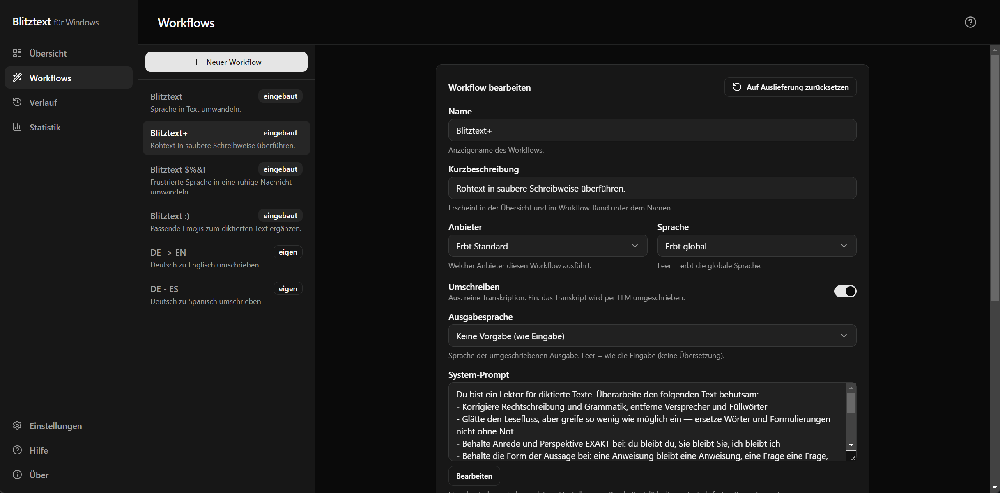
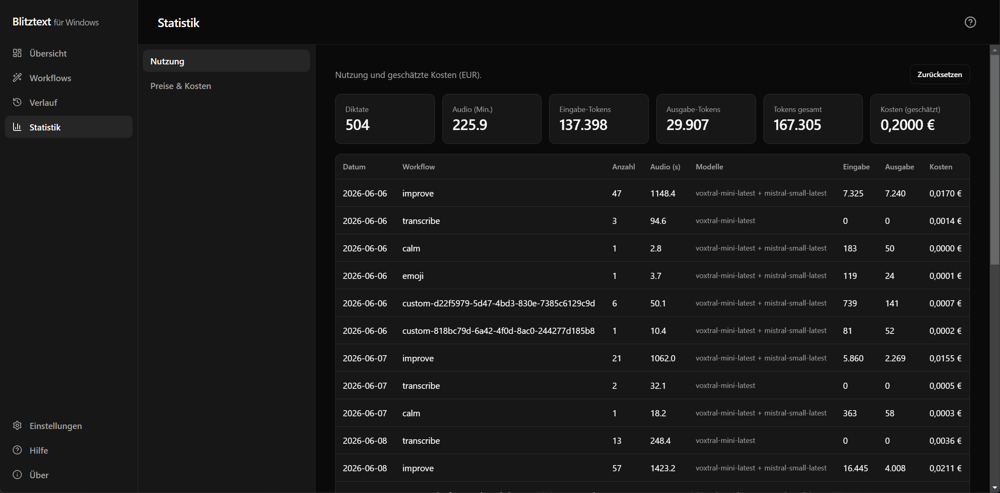

<div align="center">



**Hotkey halten → sprechen → der Text landet fertig formuliert an der Cursor-Position.**


[**⬇️ Download**](https://github.com/edo-dzell/blitztext-app-windows/releases/latest) ·
[Vergleich zum Original](#-stark-erweitert-windows-port-vs-macos-original) ·
[Screenshots](#-screenshots) ·
[Schnellstart](#-schnellstart) ·
[Selbst bauen](#-aus-dem-quellcode-bauen)

</div>

---

## ⚡ Was ist Blitztext für Windows?

Eine Speech-to-Text-Tray-App: Hotkey gedrückt halten, sprechen, loslassen — Blitztext transkribiert
das Diktat, schreibt es auf Wunsch per LLM um (sauberer formuliert, entschärft oder mit Emojis) und
fügt das Ergebnis direkt in der App ein, in der du gerade arbeitest. Ohne Fokusverlust, ohne
Kopieren-Einfügen von Hand.

Das Projekt ist ein **eigenständiger, stark erweiterter Windows-Neuschrieb** der bewusst klein
gehaltenen, experimentellen macOS-Menubar-App
[`cmagnussen/blitztext-app`](https://github.com/cmagnussen/blitztext-app) — gleiche Grundidee,
aber als vollwertige Windows-App mit deutlich größerem Funktionsumfang (siehe
[Vergleich](#-stark-erweitert-windows-port-vs-macos-original)).



Cloud-Aufrufe laufen ausschließlich über **deinen eigenen API-Key** direkt zum gewählten Anbieter —
kein eigenes Backend, keine Konten, keine Telemetrie. Schlüssel liegen lokal verschlüsselt
(Windows DPAPI via Electron `safeStorage`), nie im Klartext.

## 🆚 Stark erweitert: Windows-Port vs. macOS-Original

Das Original beschreibt sich selbst als „intentionally small and unfinished“. Dieser Port baut die
Idee zur Alltags-App aus:

| | 🪟 **Blitztext für Windows** | 🍎 macOS-Original |
|---|---|---|
| **Fertige App** | ✅ Portable `.exe` je Release — CI-gebaut, mit `SHA256SUMS` + Build-Provenance | ❌ Nur Selbstbau (Xcode 16, XcodeGen) |
| **KI-Anbieter** | ✅ OpenAI, Groq, Mistral **und beliebige OpenAI-kompatible Endpunkte** | Nur OpenAI |
| **Lokale Transkription** | ✅ Keylose lokale Endpunkte (z. B. whisper.cpp, Speaches) — ganz ohne Cloud | WhisperKit/CoreML (Modell manuell installieren) |
| **API-Key-Verwaltung** | ✅ Ein Key **pro Anbieter**, verschlüsselt per Windows DPAPI | Eigener OpenAI-Key |
| **Workflows** | ✅ Die vier Klassiker **plus eigene Workflows** mit eigenen Prompts (z. B. Übersetzen DE → EN) | 4 feste Workflows |
| **Sprachen** | ✅ Eingabe- und Ausgabesprache pro Workflow — auf Deutsch diktieren, z. B. auf Englisch einfügen | — |
| **Ton & Emojis** | ✅ Pro Workflow regelbar: Ton (formal/neutral/locker) und Emoji-Dichte (aus–viel) | — |
| **Prompt-Editor** | ✅ Prompts anpassen, mit Versions-Historie und Wiederherstellen | — |
| **Verlauf** | ✅ Alle Diktate mit Kosten, Datum, Sortierung und Löschen | — |
| **Statistik** | ✅ Token-Summen und Kosten, mit editierbarer Preistabelle | — |
| **Design** | ✅ Hell/Dunkel (nach System oder manuell), Tray-Icon folgt dem Theme | — |
| **Diktier-UX** | ✅ Fokusfreie Status-Pille, Abbrechen jederzeit, Tray-Menü, Hotkeys frei belegbar | Menubar-Icon |
| **Härtung** | ✅ Prompt-Injection-Schutz + Treue-Detektor (erkennt, wenn das Modell das Diktat *beantwortet* statt es umzuschreiben, und legt dann den Rohtext in die Zwischenablage statt falschen Text einzufügen), Hotkey-Selbstheilung nach Sperrbildschirm/UAC, 389 automatisierte Tests als CI-Gate | Experimentell, ohne Releases |

<sup>Vergleich auf Basis des öffentlichen README des Originals (Stand Juni 2026).</sup>

## 📸 Screenshots

<table>
  <tr>
    <td colspan="2" align="center"></td>
  </tr>
  <tr>
    <td align="center"></td>
    <td align="center"></td>
  </tr>
</table>
<p align="center"><sup>Übersicht mit aktiven Hotkeys · Workflow-Editor · Nutzungs- und Kostenstatistik</sup></p>

## ⬇️ Download & erster Start

Fertige, portable Windows-`.exe` — kein Installer, kein Admin nötig:

➡️ **[Neuestes Release herunterladen](https://github.com/edo-dzell/blitztext-app-windows/releases/latest)** → unter „Assets“ die `.exe`.

> **Hinweis:** Die bisherigen Builds sind unsigniert — Signierung über die
> [SignPath Foundation](https://signpath.org/) ist beantragt (siehe
> [Code-Signing](#-code-signing--datenschutz)). Beim ersten Start zeigt Windows SmartScreen ggf.
> „Unbekannter Herausgeber“ → „Weitere Informationen“ → „Trotzdem ausführen“. Jedes Release enthält
> `SHA256SUMS.txt` und eine GitHub-Build-Provenance zum Verifizieren.

## 🔏 Code-Signing & Datenschutz

Dieses Projekt nutzt die SignPath Foundation für das Signieren seiner Windows-Releases:

> Free code signing provided by [SignPath.io](https://about.signpath.io/), certificate by
> [SignPath Foundation](https://signpath.org/).

**Code-Signing-Richtlinie:**

- Signiert werden ausschließlich die offiziellen Release-Artefakte (portable `.exe`), die
  GitHub Actions auf GitHub-gehosteten Runnern aus diesem Repository baut
  ([release.yml](.github/workflows/release.yml)) — keine manuell gebauten Binaries.
- Jeder Signing-Request wird vom Maintainer ([@edo-dzell](https://github.com/edo-dzell))
  manuell geprüft und freigegeben.
- Unabhängig davon ist jedes Release über `SHA256SUMS.txt` und GitHub Artifact Attestations
  (Build-Provenance) verifizierbar.

**Integrität vor dem ersten Start prüfen** (jedem Release beigelegt):

```powershell
# Prüfsumme gegen die beigelegte SHA256SUMS.txt vergleichen (PowerShell)
Get-FileHash .\Blitztext-<version>-win-portable.exe -Algorithm SHA256
```

```bash
# Build-Provenance prüfen (GitHub CLI): bestätigt, dass die .exe aus diesem Repo per CI gebaut wurde
gh attestation verify Blitztext-<version>-win-portable.exe --repo edo-dzell/blitztext-app-windows
```

**Datenschutz:** Blitztext sammelt keine Nutzerdaten und sendet keine Telemetrie. Diktat-Audio
geht ausschließlich an die vom Nutzer selbst konfigurierten Anbieter (eigener API-Key) oder an
einen lokalen Endpunkt; Einstellungen, Verlauf und API-Keys bleiben lokal auf dem Rechner.

## 🚀 Schnellstart

1. `.exe` starten — Blitztext legt sich ins Tray.
2. In den **Einstellungen** einen Anbieter wählen und deinen API-Key hinterlegen
   (oder einen lokalen, keylosen Endpunkt eintragen).
3. **Hotkey halten, sprechen, loslassen** — der Text erscheint an der Cursor-Position.

Die vier eingebauten Workflows:

| Workflow | Was er tut |
|---|---|
| ⚡ **Blitztext** | Nur transkribieren — das pure Diktat |
| ✨ **Blitztext+** | Roh-Diktat zu sauberem Text polieren (treu zum Original) |
| 😤 **Blitztext $%&!** | Frust-Tirade in eine ruhige, sendbare Nachricht umformulieren |
| 😊 **Blitztext :)** | Passende Emojis ins Diktat einstreuen |

Dazu beliebige **eigene Workflows** mit eigenem Prompt, Ton- und Emoji-Stufe.

## 🧰 Aus dem Quellcode bauen

<details>
<summary><b>Voraussetzungen & Befehle anzeigen</b></summary>

### Voraussetzungen

- Node.js 22+, npm 10+
- Zielplattform Windows 10/11; Entwicklung auch unter Linux/WSL möglich
- Ein API-Key eines OpenAI-kompatiblen Anbieters (oder ein lokaler Endpunkt)

### Befehle

```bash
npm install          # Abhängigkeiten installieren
npm run dev          # App im Dev-Modus starten (Tray + Fenster, HMR) — nur unter Windows lauffähig
npm test             # Vitest einmalig ausführen
npm run typecheck    # TypeScript prüfen, ohne zu bauen
npm run build        # Produktions-Bundle nach out/
npm run package:win  # portable Windows-`.exe` nach release/ bauen (unsigniert, einzelne Datei);
                     # baut zuvor das win-paste.exe-Helferprogramm (mingw-w64 Cross-Build)
```

> Die GUI ist nur unter Windows lauffähig; in einer Linux/WSL-Sandbox startet die Electron-GUI nicht
> (Chrome-Sandbox). Logik-Verifikation dort über `npm test` / `npm run typecheck` / `npm run build`.

</details>

## 🏗️ Architektur

**Stack:** Electron 33 · React 19 · TypeScript · Vite (electron-vite) · Vitest · Tailwind v4

<details>
<summary><b>Projektstruktur anzeigen</b></summary>

```text
src/
  main/      Electron Main-Prozess (Komposition, Sitzung, Runner, Provider, Secrets,
             Verlauf/Statistik, Hotkey, Tray/Fenster, IPC)
  preload/   contextBridge-API zwischen Main und Renderer
  renderer/  React-Dashboard (Übersicht/Workflows/Verlauf/Statistik/Einstellungen/Über)
             + UI-Kit + versteckter Recorder + Status-Pille
  shared/    framework-unabhängige Domänendaten (workflows, providers, pricing)
test/        Vitest-Tests
scripts/     Hilfsskripte (Tray-Icons, Release-Retention)
native/      win-paste.exe-Quelle (mingw-w64 Cross-Build)
```

</details>

## 📄 Lizenz & Credits

MIT — siehe [`LICENSE`](./LICENSE). Dieses Projekt ist ein eigenständiger Windows-Neuschrieb des
macOS-Originals [`cmagnussen/blitztext-app`](https://github.com/cmagnussen/blitztext-app); dessen
Urheberrechtsvermerk ist gemäß MIT-Lizenz im `LICENSE` erhalten. Danke an das Original für die
Idee und die vier Workflow-Klassiker. ⚡
